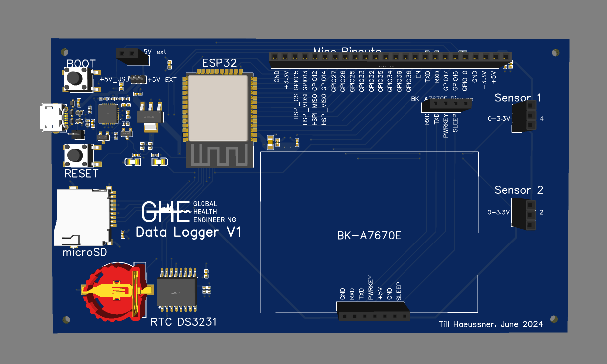

<!-- badges: start -->

<!-- badges: end -->

<h1>Data Logger for Remote Monitoring of Biogas</h1>

<b>Contributors</b>  
- Till Häussner <a href="https://orcid.org/0009-0005-7617-9312">
 0009-0005-7617-9312
</a> *author*  
- Jakub Tkaczuk <a href="https://orcid.org/0000-0001-7997-9423">
 0000-0001-7997-9423
</a> *supervisor, developer, maintainer*  
- Elizabeth Tilley <a href="https://orcid.org/0000-0002-2095-9724">
 0000-0002-2095-9724
</a> *supervisor*  

 

 

  
 
<b>Documentation available available on: 
<a href="https://global-health-engineering.github.io/GHE-data-logger/">Github pages</a>.
</b>
  
The pdf version of this documentation is available in the <code>docs</code> directory of this repo.

# Background

This repository contains an overview of an initial prototype for a data logging & transmission system, developed to gather data from remote biogas sensors in Malawi. The <a href="https://global-health-engineering.github.io/GHE-data-logger/">documentation</a> - and with it this repository - aim to act as a basis for future developers of the project. The prototype - also called the *GHE Data Logger V1* - was tested on a breadboard and then designed as two different robust PCBs. The next stages of development and recommendations for adjustments are described in section *4 Future Work* of the documentation. 

The prototype was developed within the Master's semester project by Till Häussner, contributing to a research project conducted by Natalie Boyd Williams at the Chair of [Global Health Engineering](https://ghe.ethz.ch/) at [ETH Zurich](https://ethz.ch/en.html). In her ETH postdoctoral fellowship project, she will investigate the carbon saving of installed biogas digesters in rural Malawi.

A render of one of the two PCBs is shown below:
 

 

  

# License

This work is licensed under [Creative Commons Attribution 4.0
International](https://github.com/Global-Health-Engineering/GHE-data-logger/blob/main/LICENSE.md).
